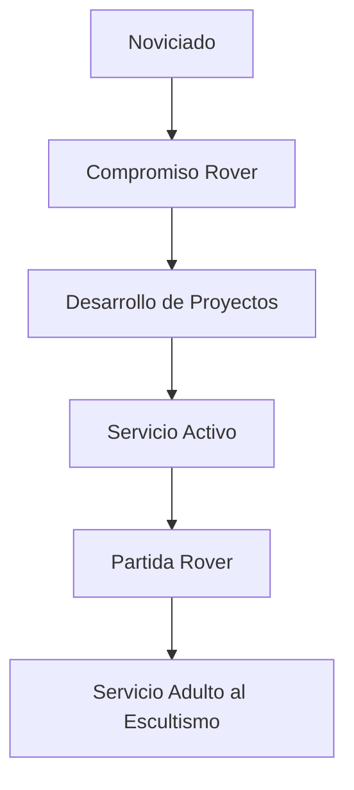

Los Rovers representan la sección mayor del movimiento scout, generalmente compuesta por jóvenes entre 18 y 21 años (o más, dependiendo de la asociación). Esta sección se caracteriza por su enfoque en el servicio, el desarrollo personal y la preparación para la vida adulta.

## Historia de los Rovers

La sección Rover fue fundada por Baden-Powell en 1918, como una extensión natural del programa scout para jóvenes que querían continuar su formación después de la etapa de exploradores.

- Orígenes y evolución
    
    Baden-Powell publicó "Roverismo hacia el éxito" en 1922, estableciendo las bases filosóficas de esta rama. A lo largo de los años, los Rovers han evolucionado adaptándose a las necesidades de los jóvenes adultos en diferentes contextos sociales y culturales, manteniendo siempre su esencia de servicio y autodesarrollo.
    

## Objetivos educativos

- Servicio a la comunidad y al escultismo
- Desarrollo personal continuo
- Preparación para la ciudadanía activa
- Exploración vocacional y profesional
- Fortalecimiento del carácter y los valores

## Estructura y organización

### El Clan Rover

La unidad básica de los Rovers es el Clan, que puede estar dividido en equipos más pequeños dependiendo del número de integrantes.

### Liderazgo y roles

1. Coordinador o Jefe de Clan: adulto que acompaña el proceso
2. Presidente o Coordinador Rover: joven elegido por sus pares
3. Responsables de áreas específicas: proyectos, servicio, actividades

### Consejo de Clan

Órgano de gobierno participativo donde se toman las decisiones importantes para el funcionamiento del grupo.

## Programa educativo

<aside>
El programa Rover se basa en cuatro pilares fundamentales: servicio, aventura, comunidad y desarrollo personal.

</aside>

### Metodología

| **Elemento metodológico** | **Descripción** |
| --- | --- |
| Aprendizaje por la acción | Experiencias prácticas y reflexión sobre ellas |
| Sistema de progresión personal | Objetivos individualizados según intereses y necesidades |
| Vida en pequeños grupos | Trabajo en equipos para proyectos específicos |
| Acompañamiento adulto | Guía no directiva que fomenta la autonomía |
| Marco simbólico | Elementos de identidad como la investidura y las insignias |

### Proyectos y actividades típicas

- [ ]  Servicio comunitario en zonas vulnerables
- [ ]  Proyectos ambientales y de conservación
- [ ]  Actividades de aventura y superación
- [ ]  Encuentros internacionales como Moots
- [ ]  Proyectos de desarrollo personal

## La Ruta Rover

> La Ruta simboliza el camino personal que cada Rover debe recorrer, definiendo sus propias metas y desafíos.
> 

### Etapas de progresión

1. **Noviciado:** Periodo inicial de conocimiento y adaptación
2. **Compromiso:** Asunción formal de los valores Rover
3. **Servicio:** Desarrollo pleno como Rover a través de proyectos
4. **Partida:** Transición hacia la vida adulta y el servicio al escultismo desde otras funciones

### La Ceremonia de Investidura

Momento significativo donde el joven adulto asume formalmente su compromiso con los valores y principios del Roverismo.

## Símbolos e identidad

### Simbología Rover

- El remo: símbolo de esfuerzo y dirección en la vida
- El color rojo: representa energía, servicio y pasión
- El lema "Servir": esencia de la actitud Rover

### Tradiciones y ceremonias

Cada asociación scout desarrolla sus propias tradiciones y ceremonias para los momentos importantes de la vida Rover, como la investidura, la partida o la finalización de proyectos significativos.

## El Roverismo en el mundo

- Diversidad de enfoques
    
    Existen diferentes interpretaciones y adaptaciones del programa Rover según cada asociación nacional y cada contexto cultural, pero todas comparten los valores fundamentales del servicio y el desarrollo personal.
    

### Encuentros internacionales

Los Moots mundiales y regionales son oportunidades para que Rovers de diferentes países compartan experiencias y fortalezcan la hermandad scout internacional.

## Desafíos actuales

### Relevancia para los jóvenes contemporáneos

El reto de adaptar el programa Rover para que resulte atractivo y significativo para los jóvenes en un mundo cambiante.

### Equilibrio entre tradición e innovación

Mantener la esencia del Roverismo mientras se incorporan nuevos enfoques y tecnologías.

### Retención de miembros

Estrategias para mantener el interés y la participación de los jóvenes adultos frente a las múltiples demandas de esta etapa vital.

## Recursos para dirigentes

- Material de apoyo
    - Manuales de programa
    - Recursos para planificación de actividades
    - Herramientas de seguimiento de progresión personal
    - Guías para la implementación de proyectos

## Testimonios de Rovers

> "Ser Rover me ha permitido descubrir mis capacidades de liderazgo mientras sirvo a mi comunidad. Es una experiencia transformadora que me ha preparado para afrontar los desafíos de la vida adulta con valores sólidos."
> 

## Preguntas frecuentes

- ¿Cuál es la edad para ser Rover?
    
    Generalmente entre 18 y 21 años, aunque puede variar según la asociación. Algunas extienden hasta los 25 años.
    
- ¿Cómo empezar un Clan Rover?
    
    Se requiere un grupo de jóvenes interesados, un adulto facilitador, y el respaldo del grupo scout o la asociación local.
    
- ¿Se necesita experiencia previa en escultismo?
    
    No es obligatorio. Muchos jóvenes se incorporan directamente a Rovers sin haber pasado por otras secciones scout.
    



## Referencias y bibliografía

- Baden-Powell, R. (1922). *Roverismo hacia el éxito*.
- Organización Mundial del Movimiento Scout. (2015). *Política Mundial de Programa Scout*.
- Varias asociaciones scouts. *Manuales y documentos de programa Rover*.

# Ejemplos de bloques con diferentes colores

Este es un ejemplo de texto en color rojo para mostrar cómo se pueden aplicar colores a diferentes tipos de bloques en Notion.

- Lista con viñetas en color verde para organizar información de manera visual
1. Lista numerada en color púrpura que puede usarse para procedimientos o secuencias
- Toggle en color naranja
    
    Los toggles permiten ocultar o mostrar contenido adicional según sea necesario
    

> Las citas con fondo amarillo son excelentes para destacar pensamientos importantes o referencias
> 
- [ ]  Tarea pendiente con color rosa para marcar elementos por completar
- [x]  Tarea completada con color gris para mostrar progreso

<aside>
Los callouts con fondo azul son perfectos para destacar información importante o consejos

</aside>

```jsx
// Bloque de código para mostrar ejemplos de programación
function saludar() {
  console.log("Hola mundo scout");
}

```

$$
\sum_{i=1}^{n} i = \frac{n(n+1)}{2}
$$

### Columna izquierda

Las columnas permiten organizar el contenido de manera horizontal

### Columna derecha

Muy útil para comparaciones o presentar información relacionada

| **Tipo de bloque** | **Utilidad principal** |
| --- | --- |
| Encabezados | Organización jerárquica |
| Listas | Enumerar elementos |
| Toggles | Contenido expandible |